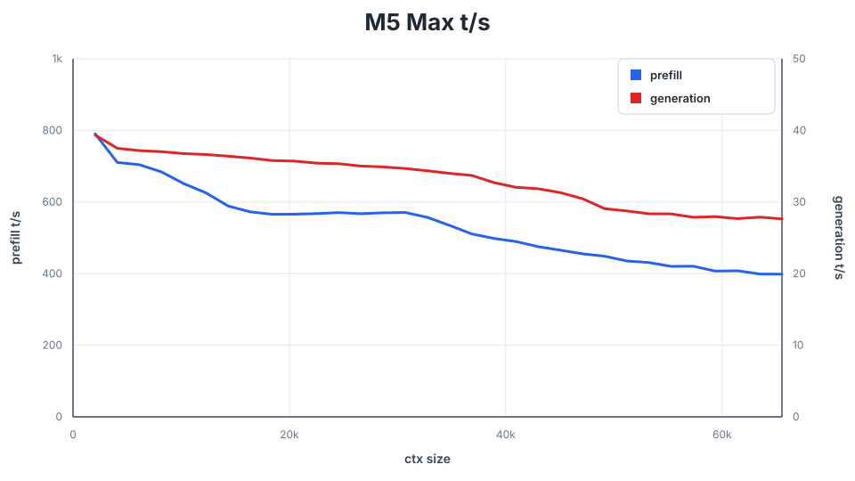
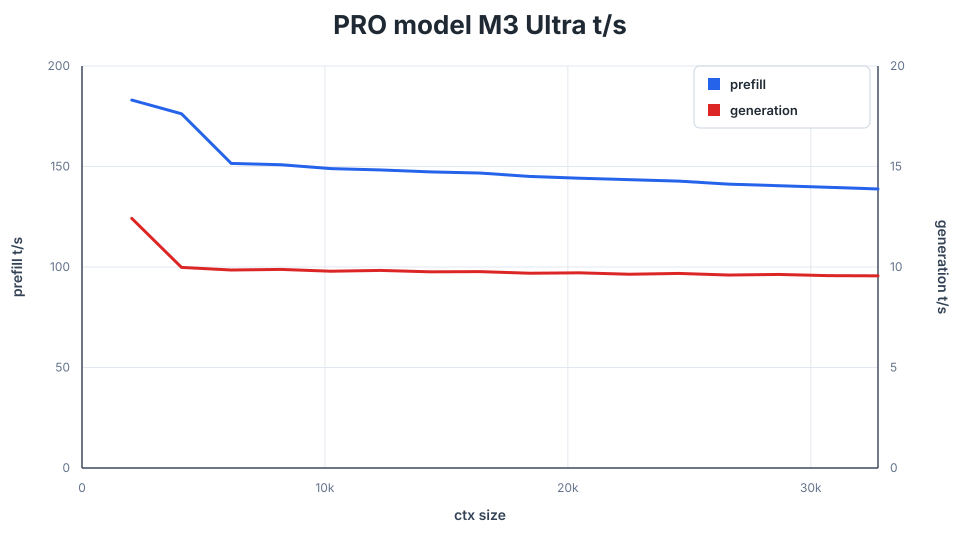

# Performance and Benchmarking

[README](../README.md)

Compare the same checkpoint, quantization, context, and sampling settings.
Record the commit and whether weights were resident, streamed, or distributed.
Keep other GPU workloads idle and repeat in alternating order: one favorable
run is not a speed result.

## Context sweeps

`ds4-bench` measures prefill and generation at successive context frontiers:

```sh
./ds4-bench -m ds4flash.gguf \
  --prompt-file speed-bench/promessi_sposi.txt \
  --ctx-start 2048 --ctx-max 65536 --step-incr 2048 --gen-tokens 128
```

Each prefill number measures the newly added interval. Generation uses a fixed
greedy, non-EOS probe. The benchmark normally restores a memory snapshot after
each probe; network TP/pipeline runs and snapshots beyond its memory limit use
prefix replay instead. Do not interpret replay time as continued-prefill speed.

Use `--step-mul F` for exponential context spacing. Output is CSV, including
prefill throughput, generation throughput, and snapshot size when available.
The prompt is the cleaned public-domain *I Promessi Sposi* text in
[speed-bench](../speed-bench/README.md).

Prefill defaults are configuration-specific: ordinary DeepSeek uses 4096-token
chunks, CUDA TP uses 2048, and long PRO prompts may use 8192. GLM chooses its
own chunks and rejects `--prefill-chunk`. The strict DeepSeek API-vector test
pins 2048; do not generalize that setting to every benchmark.

## Recorded Flash Q2 baseline

These existing sweeps use 2048-token intervals and 128 generation tokens per
frontier. They are recorded baselines, not measurements of every subsequent
commit. Full data: [M5 Max](../speed-bench/m5_max.csv) and
[DGX Spark](../speed-bench/gb10.csv).

| Machine | Context | Prefill | Generation |
| --- | ---: | ---: | ---: |
| M5 Max, 128 GB | 2048 | 790.18 t/s | 39.35 t/s |
| M5 Max, 128 GB | 16384 | 572.53 t/s | 36.14 t/s |
| M5 Max, 128 GB | 32768 | 557.04 t/s | 34.36 t/s |
| M5 Max, 128 GB | 65536 | 398.50 t/s | 27.64 t/s |
| DGX Spark, 128 GB | 2048 | 825.76 t/s | 18.05 t/s |
| DGX Spark, 128 GB | 16384 | 872.44 t/s | 15.10 t/s |
| DGX Spark, 128 GB | 32768 | 855.94 t/s | 14.43 t/s |
| DGX Spark, 128 GB | 65536 | 822.98 t/s | 13.84 t/s |



Historical PRO Q2 measurements on the M3 Ultra are retained in this chart:



## What to compare next

- For SSD streaming, record the effective cache and distinguish cold startup
  from a warm cache.
- For multiple sessions, report both individual latency and aggregate
  throughput. Ordered fallback is not native batching.
- For DSpark/MTP, compare plain decode too. A faster drafter path can still be
  slower than ordinary decoding on an unpredictable prompt.
- For TP, keep quantization and prompt equal; comparing resident Q4 on two
  machines with streamed Q4 on one measures capacity benefits as well as parallelism.

Recent focused TP and DSpark comparisons, including their limitations, live in
[QA_BEFORE_RELEASES.md](../QA_BEFORE_RELEASES.md). Use its speed-regression
procedure rather than accumulating one-off timings in the main README.
