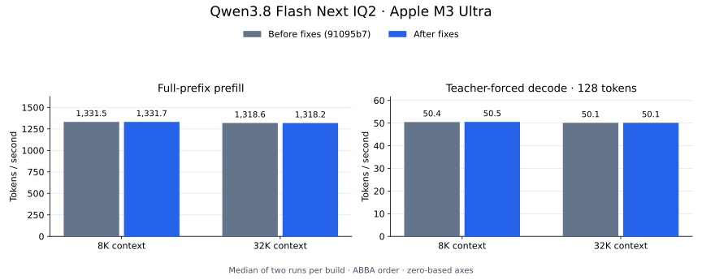
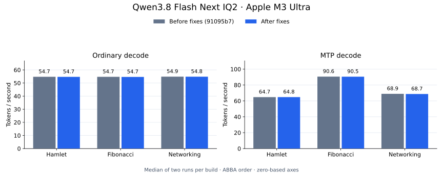

# Qwen checkpoint fixes: benchmark comparison

Measured on 2026-09-13 using an Apple M3 Ultra with 512 GiB RAM. The baseline
is PR head `91095b7`; the fixed runtime was tested at `d8ba365`, before these
charts were added to the squashed commit. Both builds used the same
`Qwen3.8-Flash-Next-IQ2XXSImatrix-Q2KDownPad768-MTP.gguf` model and
`Qwen3.8-Flash-Next-PLE-Q4_1.gguf` sidecar.

Both executables were warmed before measurement. Each case ran in baseline,
fixed, fixed, baseline order with no concurrent model workloads. Charts show
medians of two runs per build; [results.csv](results.csv) retains every run.
All throughput differences were below 0.7%. Generated text was byte-identical
across both builds and repeats in all six generation cases. These short local
runs do not establish statistical equivalence.



Each context run prefills the complete prefix from a fresh session, with
8,192-token chunks, then evaluates 128 teacher-forced decode tokens. The shared
prompt was a frozen copy of `ds4.c` from `91095b7`. Context allocation was the
prefix length plus 257 tokens. The 32K case includes intermediate chunks where
the fix now computes valid checkpoint logits.



Generation uses an 8,192-token context, temperature zero and thinking disabled.
MTP runs use `--mtp --mtp-timing`. The prompts and token limits are:

| Case | Limit | Prompt |
|---|---:|---|
| Hamlet | 120 | Write a three-sentence summary of the plot of Hamlet. |
| Fibonacci | 400 | List the first 30 Fibonacci numbers with indices. |
| Networking | 256 | Explain how a computer sends a web request over TCP and receives the response. Write four clear paragraphs for a programmer learning networking. |

Regenerate the SVG charts from the CSV:

```sh
uv run --with matplotlib python speed-bench/qwen38-checkpoints/plot.py
```

Add `--png-dir /path/to/output` to export PNG copies too. The figures use
zero-based axes and separate prefill and decode panels.
